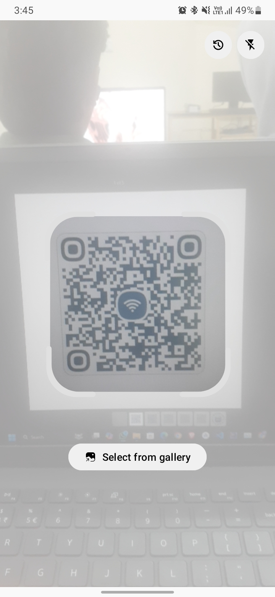
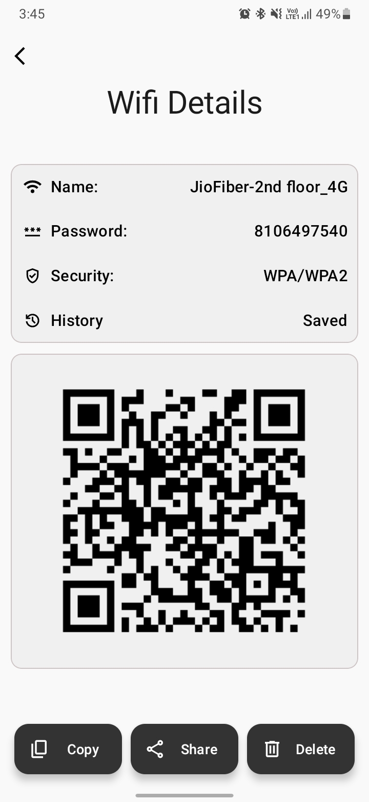
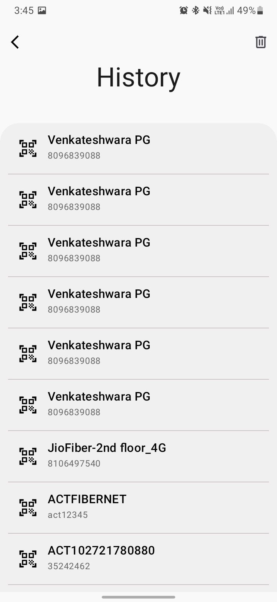
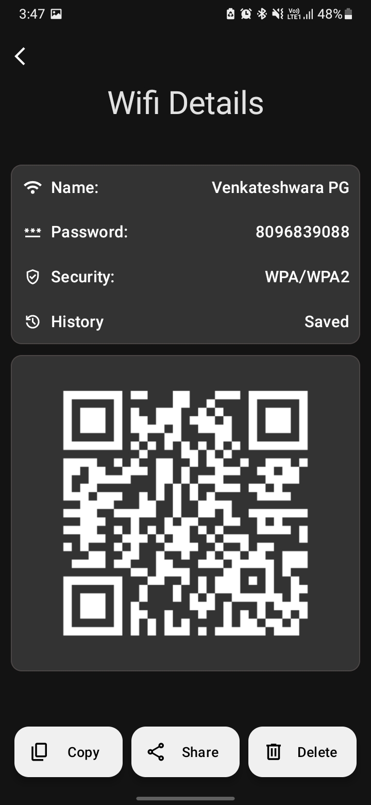
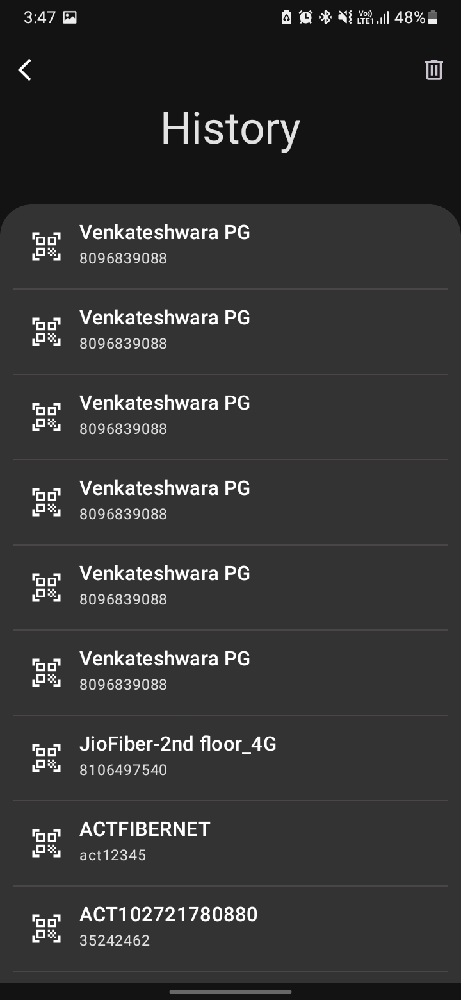
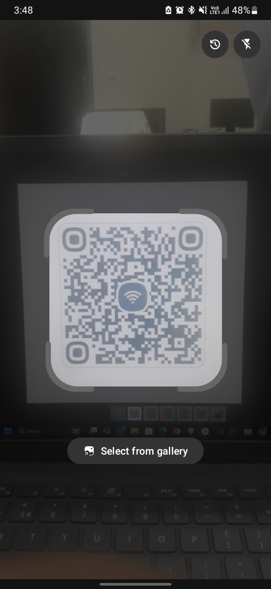

# Wifi QR Scanner

## Description

The **Wifi QR Scanner** is an Android application that allows users to scan WiFi QR codes to retrieve network credentials (SSID and password). Instead of automatically connecting to the WiFi network, the app displays the details and securely stores them locally on the device using SQLite for future reference.

## Features

- Scan QR codes to extract WiFi network details (SSID and password).
- Displays WiFi credentials in a user-friendly interface.
- Stores scanned WiFi details in SQLite for offline access and future use.
- Simple and intuitive user experience.

## Screenshots

Below are some screenshots of the application:

<div style="display: flex; flex-wrap: wrap; justify-content: center;">
  
  
  
  
  
  
</div>


## Technologies Used

- **Language:** Java
- **IDE:** Android Studio
- **Database:** SQLite
- **Platform:** Android

## Prerequisites

To set up and run the project locally, ensure you have the following:

- Android Studio (latest version recommended)
- Java Development Kit (JDK 8 or newer)
- A physical or virtual Android device for testing

## Installation

Follow these steps to set up the project locally:

1. Clone the repository:
   ```bash
   git clone https://github.com/varuns18/Wifi-QR-Scanner.git
   ```
2. Open **Android Studio**.
3. Select **"Open an Existing Project"** and navigate to the cloned repository folder.
4. Let Android Studio sync the project and resolve dependencies.
5. Build the project by selecting **Build > Make Project** in the top menu.
6. Run the app by selecting **Run > Run 'app'** or pressing `Shift + F10`.

## Usage

1. Launch the Wifi QR Scanner app on your Android device or emulator.
2. Point your device's camera at a QR code containing WiFi credentials.
3. The app will extract the SSID and password from the QR code and display them.
4. The extracted details will be stored locally in SQLite for future reference.
5. View or manage saved WiFi details in the app.

## Contributing

Contributions are welcome! To contribute:

1. Fork this repository.
2. Create a new branch for your feature or bug fix:
   ```bash
   git checkout -b feature-name
   ```
3. Make your changes and commit them:
   ```bash
   git commit -m "Add feature-name"
   ```
4. Push your branch:
   ```bash
   git push origin feature-name
   ```
5. Open a pull request describing your changes.

## License

This project is licensed under the MIT License. See the [LICENSE](LICENSE) file for details.

## Contact

For questions, suggestions, or feedback, reach out to the repository owner:

- **GitHub Profile:** [varuns18](https://github.com/varuns18)
